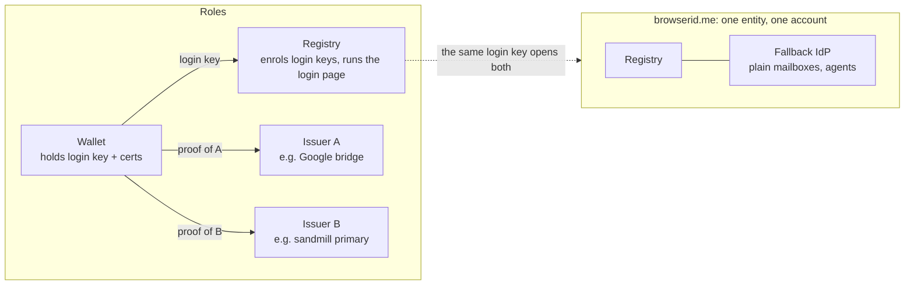
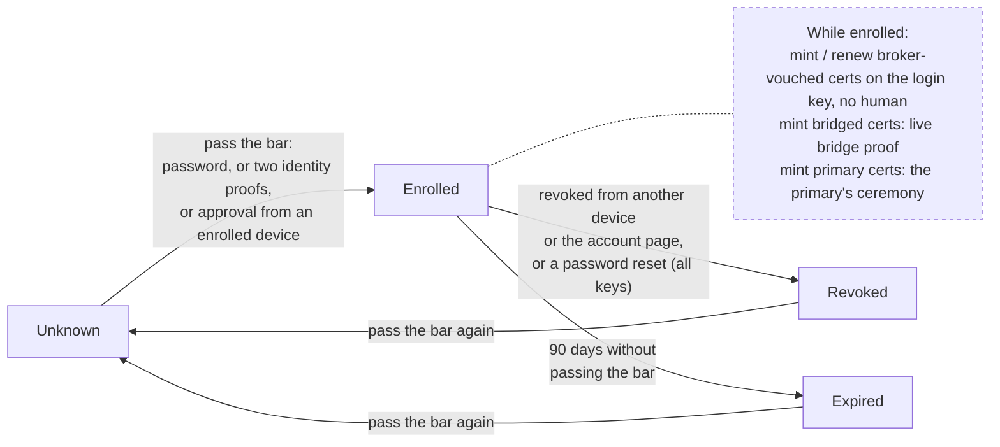
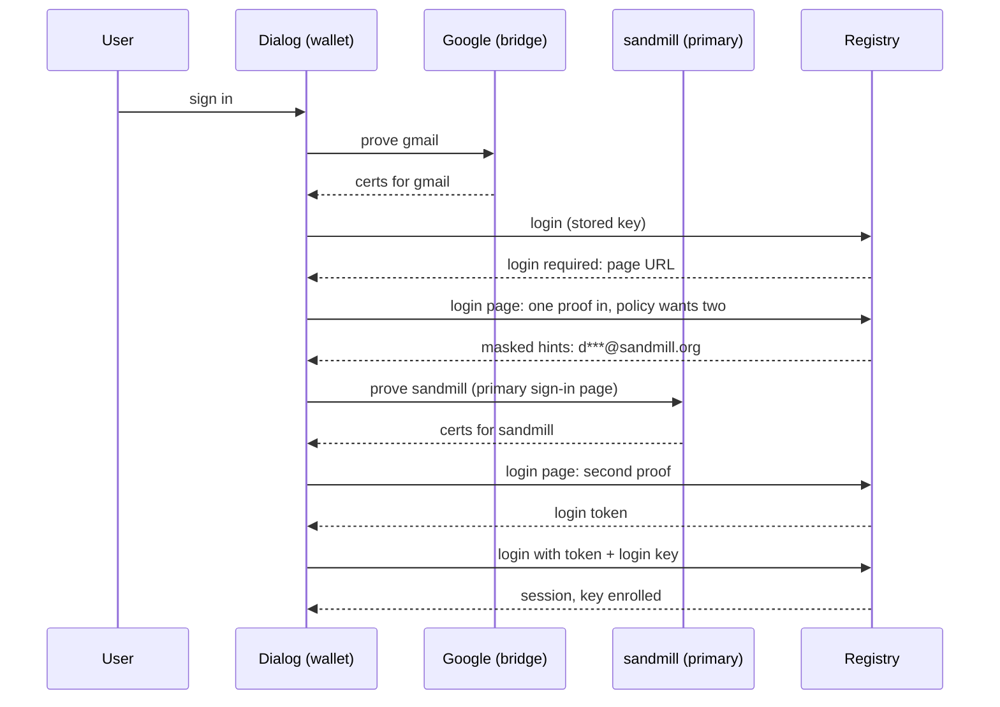
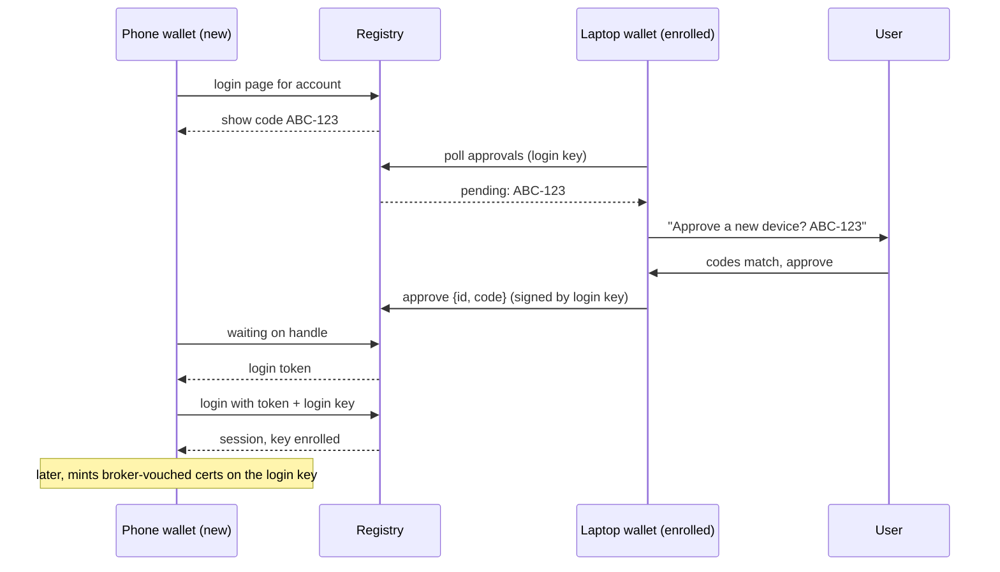
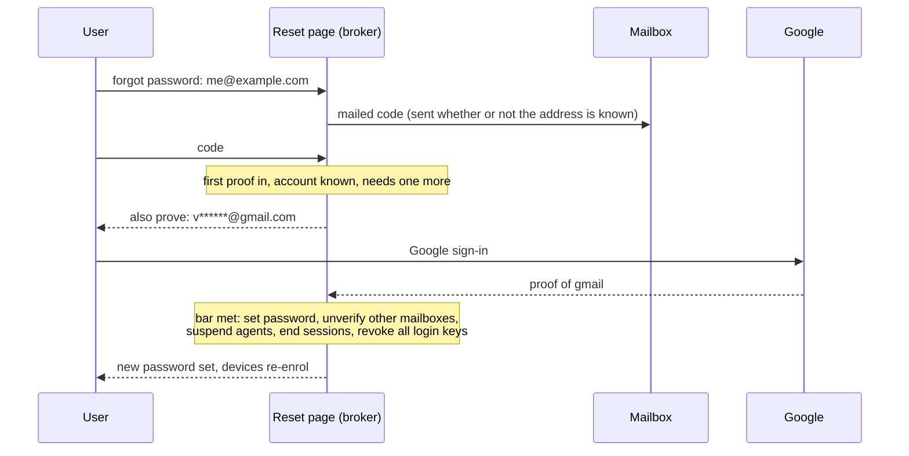

# Adding a device to an account — review draft

Status: draft for review, 2026-09-14. Proposes how a device gets into an
account, what it may do once in, and how the password is reset, for the
registry and for the fallback IdP together. Companion to
`docs/specs/registry-api-v1.md` and `docs/specs/fallback-idp-api-v1.md`.

## Today

An account at browserid.me is one record with one password, reached
through two doors. The fallback IdP's ceremony page issues identity
certs; the registry's login page opens the session that manages
devices and warrants. Both doors check the same password, so a new
device types it twice, and an account that has no password (a Gmail
user who only ever used the Google bridge) cannot use the registry at
all. The password is the only way in that is not tied to one specific
identity.

## Terms

- **Identity**: an address on the account. Each has an **issuer** that
  can prove it: Google's sign-in for a bridged Gmail address, a
  primary's own page for its domain, a mailed code for a plain mailbox.
  Broker-vouched identities are the ones the broker issues itself:
  plain mailboxes (SMTP) and agent identities.
- **Proof**: completing the issuer's ceremony for one identity, which
  leaves the device holding certs for it.
- **Login key**: a key each device generates once and brings to the
  registry. Once **enrolled** on the account it is the device's
  credential: no cookie, no password, every call signed by it.
- **Approval**: a device already enrolled confirms, in its own UI, that a
  new device asking to join is the user's.
- **Hold**: when an identity leaves an account it stays suspended there
  for 30 days and can be restored (registry spec §4.1).

## The model

The password is not an identity proof. It is the account's own
credential, the one thing that belongs to the account rather than to
any of its identities. That gives it two roles: on its own it satisfies
the add-a-device bar below, and at the broker's own ceremony page it is
what proves a plain mailbox (the broker has no stronger check for the
identities it issues itself).

A device joins an account by passing the **add-a-device bar**: the
account password, or proofs of two of the account's identities, or
approval from an enrolled device. Passing it once both enrols the
device's login key at the registry and logs it in there. From then on
the login key is the device's credential for both doors: the registry
runs on it, and the fallback IdP, which is the same entity holding the
same account, accepts it to re-issue the broker-vouched identities.
Bridged identities are the deliberate exception: every mint re-proves
them live at the bridge, because that proof is cheap and the broker
should never vouch for Google's addresses on its own say-so.

Which combinations count is a policy stored per account, with a
baseline, user overrides, and room for signal-driven tightening later.

The roles, and how browserid.me instantiates them:

A device's life on an account:

## Flows

**First device, new account.** The wallet proves one identity at its
issuer. It creates the account with that proof, which also enrols its
login key. An account with a single identity can add later devices only
by password or approval, since there is no second identity to prove.

**Add a device, web dialog, Gmail + sandmill account.** The user signs
in as Gmail through the Google popup. The registry does not know this
device, so it sends the dialog to the login page. The page sees an
account whose policy accepts two proofs and asks for one more identity,
naming the candidates in masked form (`d***@sandmill.org`) now that one
proof is in. The sandmill primary's sign-in page runs. The login page returns a login
token, the dialog enrols its key, and the device holds certs for both
identities. No password was typed.

**Add a device, native wallet on a phone.** The wallet asks which
account and opens the login page, which shows a short code. The user's
laptop wallet, already enrolled, shows a native dialog: "Approve a new
device? Code ABC-123". The user compares the codes and approves. The
page returns a login token and the phone is enrolled. It has proven no
identity yet and holds no certs; it gets them in the next flow.

**Mint certs on an enrolled device.** For a broker-vouched identity the
wallet calls the issuance endpoint signed by its login key, with no
human step, as long as the policy's mint rule holds (baseline: being
enrolled is enough). For a bridged identity the bridge runs live. For a
primary identity the primary's own ceremony runs; the login key means
nothing to another issuer.

**Sign in at a site on an enrolled device.** The wallet presents from
the certs it holds. Neither server is involved.

**Renew.** Broker-vouched certs last 90 days; the wallet re-runs the
mint flow on its login key. The login key itself lasts 90 days from the
last time a human passed the add-a-device bar on that device; renewing
it is another pass of that bar.

**Manage the account.** Listing and revoking devices, warrants, and
identities all run under a registry session on the login key. A lost
device is revoked from any other enrolled device or from the account
page; revoking its key ends its sessions and retires its certs.

**Change the password.** Requires the current password. Login keys are
untouched.

**Reset the password.** A reset is one ceremony that must meet the
**proof bar** before anything changes: proofs of two of the account's
identities, or of its only identity when it has just one. Approval from
an enrolled device does not count, so a stolen unlocked device cannot
take the whole account; reset sits above the add-a-device bar on
purpose. There is no half-done state.

When the ceremony completes, the new password is set and is a normal
credential from then on. Every plain mailbox that was not proven in the
ceremony is marked unverified and re-verifies on first use. Agent
identities are suspended until their parent identity is proven again.
All browser sessions are ended and every login key is revoked, so each
device passes the add-a-device bar again. Bridged and primary
identities need nothing; they are re-proven live whenever they mint.

Three shapes: an account with a single mailbox resets on one mailed
code, which is today's behaviour. Mailbox plus Gmail resets on the code
plus the Google popup, on one page. Mailbox plus a primary the user has
lost access to cannot be reset at all; the user creates a new account,
proves the mailbox there, and the old account drops after the hold.

The reset page starts cold, with an address and a mailed code, which is
safe against account enumeration because a code is sent whether or not
the address is known. After that first proof the page knows the
account, shows masked hints for what else it will accept, and collects
the remaining proofs. Whether the address belongs to an existing
account or starts a new one is decided server-side after the first
proof, as the sign-in-code path does today.

## The policy

Requirements are data rather than code paths, so they can differ per
account and later respond to signals. Two chokepoints evaluate them:
the registry when it enrols a login key, and the broker when it decides
whether to mint.

For each login key the registry records how it was enrolled, one of
`password`, `proofs` with the identities proven, or `approval` with the
approving key, and which identities the device has since proven, which
are the certs recorded under sessions on that key.

A requirement is a list of alternatives, and each alternative is a set
of conditions from: `password`, `proofs >= k`, `approval`, `enrolled`,
`proven >= k`, `proven(identity)`, `enrolled_by in {…}`. Here `k` is a
count and the account's number of identities caps it.

Baseline:

| Action | Requirement |
|---|---|
| enrol a device | `password` or `proofs >= 2` or `approval` |
| mint a broker-vouched identity | `enrolled` |
| mint a bridged identity | live bridge proof; outside the policy |
| manage the account | `enrolled` |
| reset the password | `proofs >= 2`; `approval` never counts |

Overrides an account may set, within floors, from the account page:
raise the proof count; require the password in every alternative;
disable approval; require `proven >= k` or `proven(identity)` before
minting, so that for example a phone can be approved in but must prove
two identities itself before the broker mints there. A third layer,
driven by signals such as a new network, a young enrolment, or a burst
of revocations, can only tighten. Floors: enrolment can never be
satisfied by nothing, and a key enrolled by approval cannot itself
approve until the device has proven at least one identity, so a chain
of approvals cannot run away from the user's real credentials. A proof
is the check here, not a timer: waiting adds nothing.

Session levels are unchanged. Browser cookie sessions keep their
"password was typed" flag, which is what the mint check reads today.
Registry sessions have no level. The mint check gains a second input,
the calling device's login-key record, and allows a broker-vouched
identity when the mint rule holds. The cookie path is untouched.

## What changes where

Registry API (§4.2, §5.2.3): the login-key record gains how it was
enrolled; a policy object at `GET/PUT /api/v1/account/policy`;
approvals at `POST /api/v1/approvals` (opened by the login page,
returns a code and a handle to wait on), `GET /api/v1/approvals`
(enrolled devices poll, or the inbox lists them), and
`POST /api/v1/approvals/approve { id, code }` under a session with the
request proof. The login page's own methods are unchanged from the
API's point of view: password, proofs, and the code all live inside it.

Fallback IdP (§3): an issuer that is also the wallet's registry accepts
the registry's request proof on its issuance endpoint in place of the
ceremony, for broker-vouched identities only. Its ceremony page may
return a login token alongside the certs when the proof it just took
meets the enrol rule, so a new device passes one ceremony, not two.
The wallet learns the two roles are one entity from discovery: the same
origin serves both.

Broker: one account-authentication module behind both the ceremony
page and the login page, taking the proofs collected in a ceremony and
answering whether a rule is met; the mint check grows its device input.
Wallet and dialog: the login page collects identity proofs through the
wallet's own login mediator running inside the page (bean e98a), shows
the approval code, and the native wallet gets an approval dialog.

## Decisions taken in review

- A key enrolled by approval may approve others once its device has
  proven one identity; no ageing period.
- After one proof, the login and reset pages show the remaining
  candidate identities as masked addresses.
